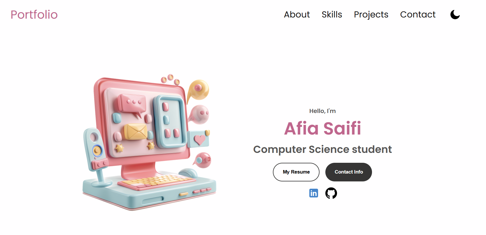

# 💻 Afia Saifi — Personal Portfolio

> A personal portfolio website built with HTML, CSS, and JavaScript to showcase my projects, hobbies and skills as a Computer Science student.

🔗 **[View Live Site](https://afiasaifi.netlify.app/)** &nbsp;|&nbsp; 👩‍💻 **[LinkedIn](https://www.linkedin.com/in/afia-saifi-100b7827a/)** &nbsp;|&nbsp; 🐙 **[GitHub](https://github.com/afiasaifi)**

---

## ✨ Overview

This is my first personal portfolio project — a fully responsive website designed to give visitors a glimpse into who I am, what I can do, and what I've built. It features a clean, modern aesthetic with both light and dark mode support.

---

## 🛠️ Built With


---

## 🌟 Features

- **Responsive Design** — looks great on desktop, tablet, and mobile
- **Dark / Light Mode** — toggle between themes with a single click
- **Smooth Navigation** — scroll-based nav with section links (About, Skills, Projects, Contact)
- **Resume & Contact** — direct access to my resume and contact information
- **Social Links** — quick links to LinkedIn and GitHub

---

## 📸 Preview



---

## 🚀 Getting Started

No build tools needed — just open the file in your browser!

```bash
# Clone the repository
git clone https://github.com/afiasaifi/html-css-js-myportfolio.git

# Open in browser
open index.html
```

---

## 📬 Contact

Have feedback or want to connect?

- 💼 [LinkedIn](https://www.linkedin.com/in/afia-saifi-100b7827a/)
- 🐙 [GitHub](https://github.com/afiasaifi)

---

<p align="center">Made with 💗 by Afia Saifi</p>
